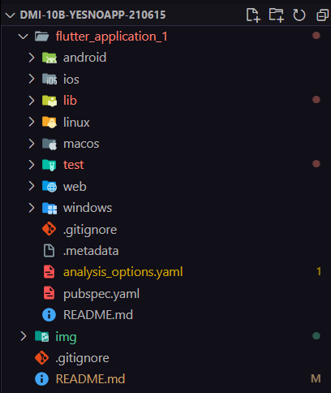
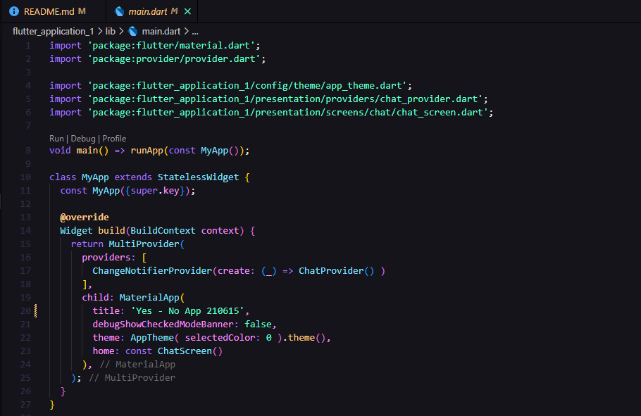
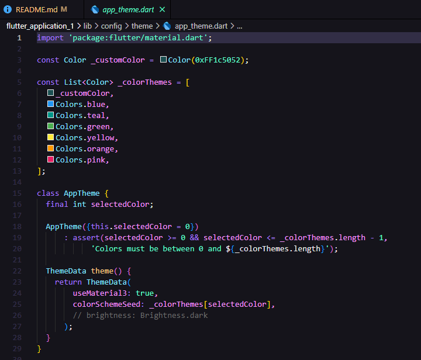
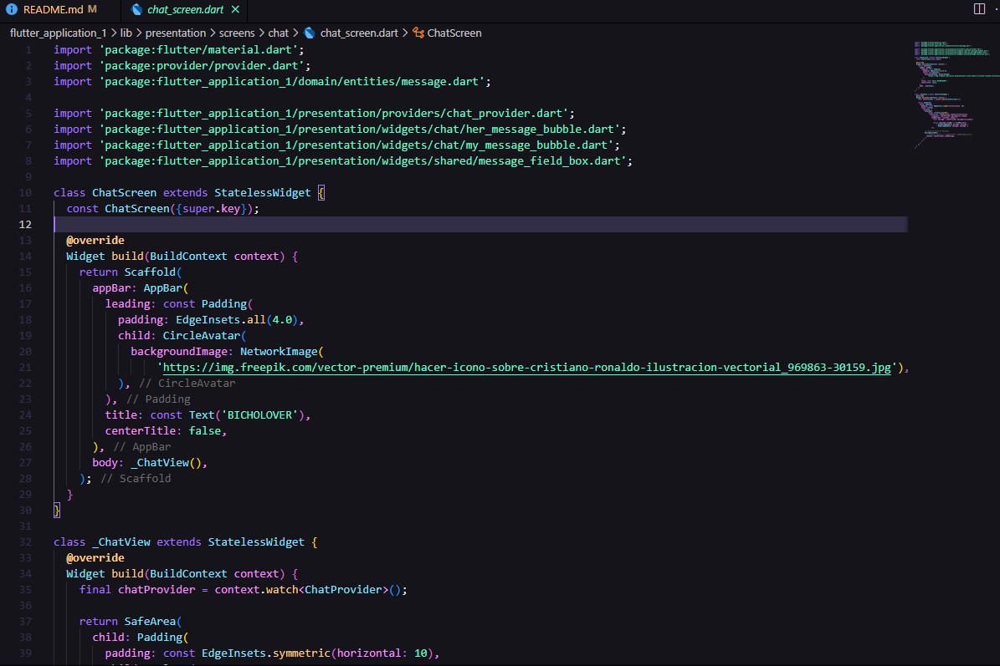
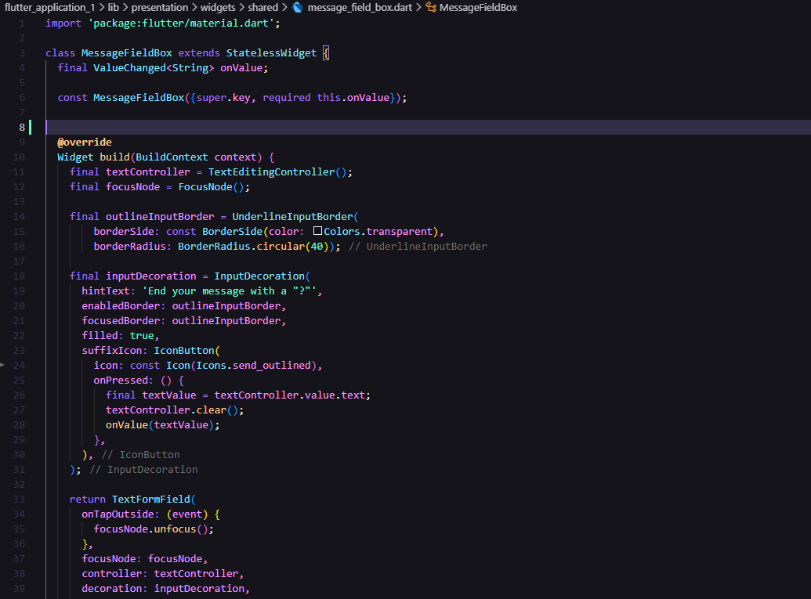
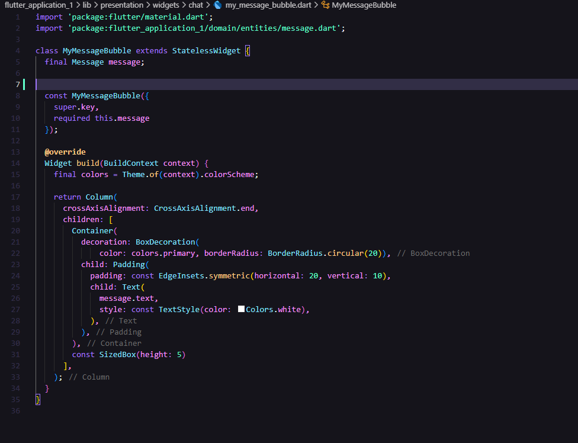
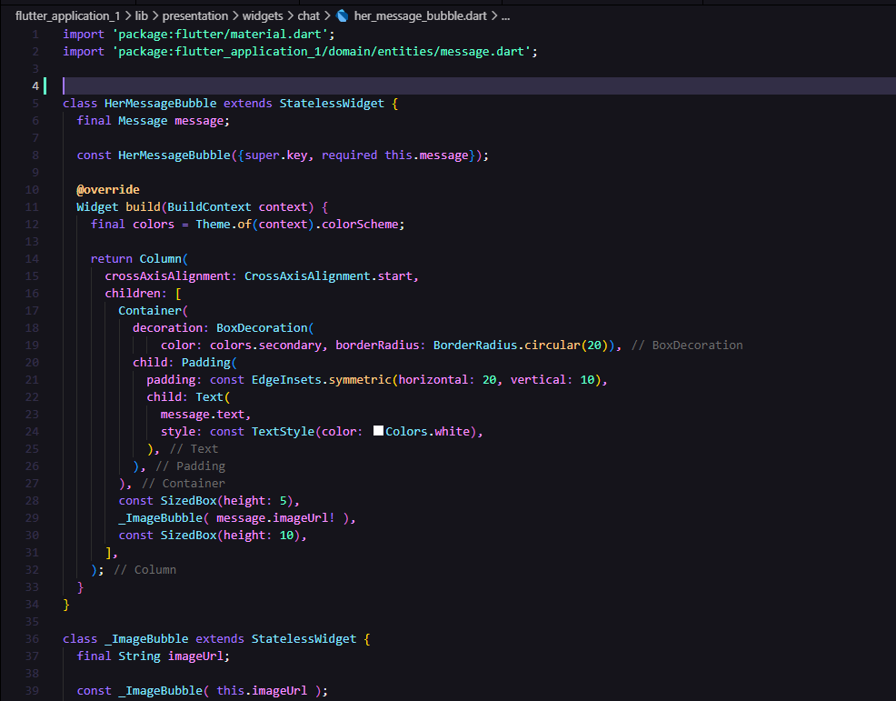
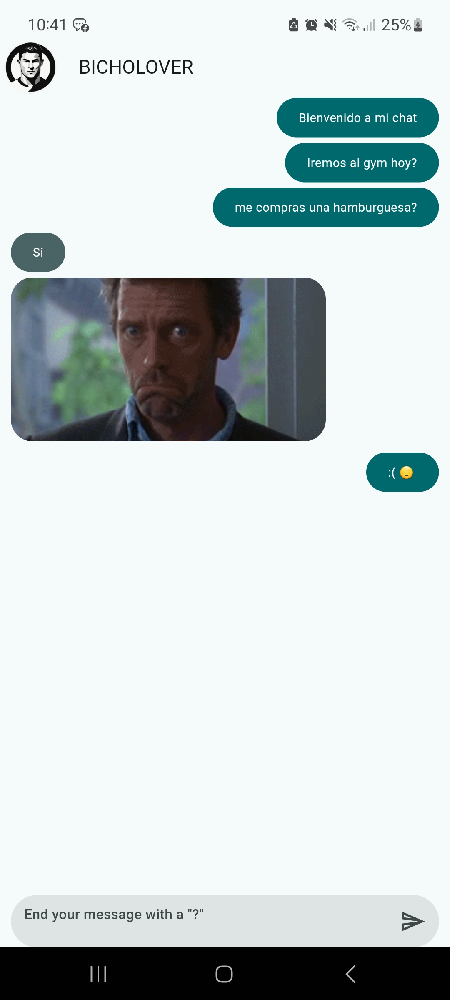

 
 
<h1 align="center"> Universidad Tecnológica de Xicotepec de Juárez </h1>
 

<h2 align="center"> Desarrollo Móvil Integral </h2>
<h2 align="center"> DMI-10B-YesNoApp 210615 </h2>
<h2 align="center"> Por: Marco Antonio Morales Rivera </h2>
 
<h2> Objetivo </h2>
Realizar una aplicación en Flutter para Dispositivos Móviles, parte de la Unidad 2 de la asignatura de Desarrollo Móvil Integral, para comprender el usos de Stateless y Statefull Widgets.
 
<h2 align="center"> Documentación del proyecto </h2>

### HISTORIAL DE PRÁCTICAS:
|No.|Nombre|Potenciador|Estatus|
|--|--|--|--|
|21||Agregacion de Widgets|6|Finalizada|
|22|Implementacion de la UI|7|Finalizada|
|23|Implementacion de respuesta del chat|10|Finalizada|

## Estructura de las carpetas 
 

 
<h3> Practica 21 </h3>

| Captura | Descripción | 
|:-------------:|:---------------|
|  |El archivo main.dart es el punto de entrada de la aplicación. Inicializa la aplicación con el widget MyApp, que configura el estado mediante Provider, aplica un tema personalizado definido en AppTheme, y establece la pantalla principal (ChatScreen). Esto asegura una gestión centralizada del estado y una interfaz consistente basada en Material Design. |
|  |AppTheme define un tema dinámico para la aplicación Flutter, permitiendo personalizar el esquema de colores basado en un índice. Utiliza Material Design 3 para ofrecer una experiencia visual uniforme.|
|  |ChatScreen es la pantalla principal del chat. Incluye una barra superior con un avatar y un título, y utiliza _ChatView para mostrar la conversación. Proporciona una estructura básica para interactuar con los mensajes.|

<h3> Practica 22 </h3>

| Captura | Descripción | 
|:-------------:|:---------------|
|  |_ChatView administra y muestra los mensajes en un ListView.builder, con burbujas diferenciadas según el remitente. Incluye un campo de texto para enviar nuevos mensajes.|
|  |MyMessageBubble estiliza los mensajes enviados por el usuario. Utiliza el color primario del tema como fondo y texto blanco para garantizar la legibilidad.|
|  |OtherMessageBubble muestra mensajes de otros participantes en el chat. Utiliza un diseño limpio con un color secundario y márgenes adecuados para separar los mensajes.|
|  |_ImageBubble muestra imágenes en el chat con bordes redondeados y un diseño responsivo. Incluye un indicador de carga para mejorar la experiencia de usuario.|
|  |MessageFieldBox ofrece un campo de texto interactivo para escribir y enviar mensajes. Incluye un botón de envío estilizado y manejo del foco para facilitar la interacción.|

<h3> Practica 23 </h3>

| Captura | Descripción | 
|:-------------:|:---------------|
|  |YesNoModel actúa como modelo de datos para respuestas de tipo "sí" o "no". Permite la conversión a formatos JSON y su transformación en una entidad de dominio llamada Message.|
|  |ChatProvider gestiona el estado del chat, incluyendo envío de mensajes, respuestas automáticas y actualizaciones de la interfaz.|
|  |GetYesNoAnswer conecta la API de yesno.wtf con la lógica de la aplicación. Procesa respuestas HTTP y las transforma en objetos internos para integrarlas al flujo del chat.|
|  |El método moveScrollToBottom asegura que los mensajes más recientes sean visibles mediante un desplazamiento automático, mejorando la experiencia del usuario.|

## Resultados
 

